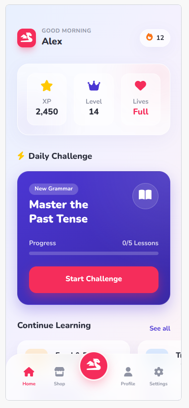
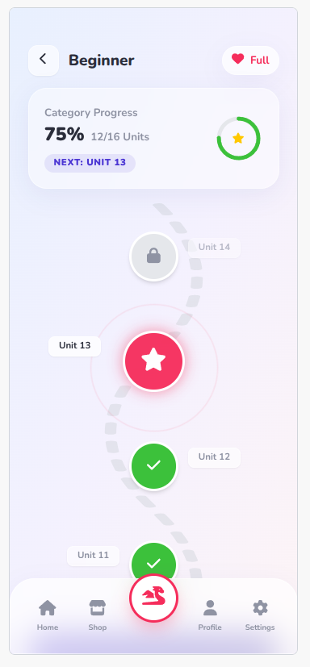
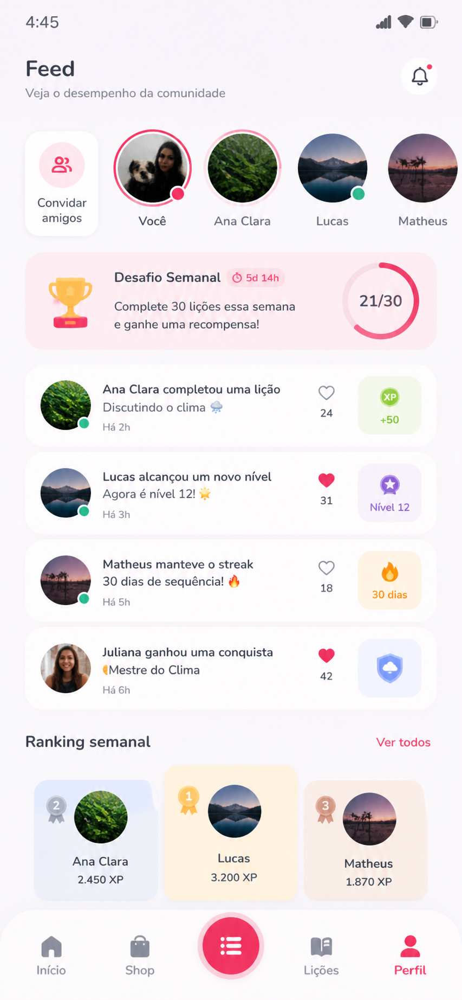
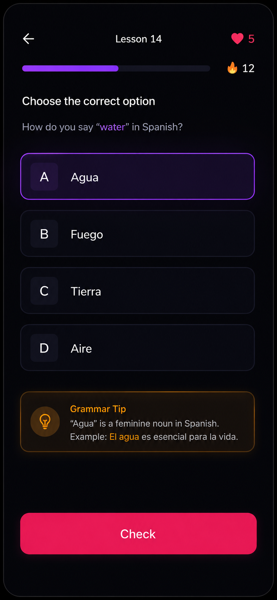
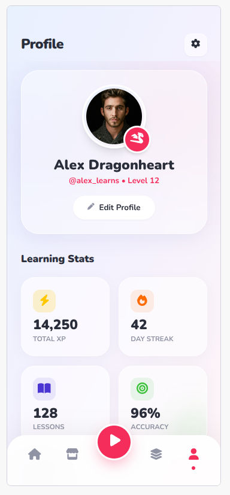

# Draksy: Lingua Quest 🐉

[](https://flutter.dev)
[](https://riverpod.dev)
[](https://medium.com/flutter-community/flutter-clean-architecture-b35393161c9b)
[](https://opensource.org/licenses/MIT)

**Draksy** is a gamified language learning application built with Flutter, designed to make education as engaging as an RPG. Master new languages by embarking on quests, earning XP, and climbing the leaderboards.

---

## 🚀 Key Features

- **RPG Progression:** Complete lesson nodes, earn experience points (XP), and maintain streaks to level up your character.
- **Dynamic Lessons:** Interactive lesson engine supporting multiple question types, translations, and explanations.
- **Social Feed:** Stay motivated by following friends' activities, celebrating their milestones, and competing in weekly challenges.
- **Global Leaderboard:** Compete in leagues based on weekly performance.
- **Responsive Design:** Optimized experience across Mobile, Tablet, and Desktop using a unified codebase.
- **Offline-First:** Robust local persistence powered by Hive CE for a seamless experience.

---

## 🏗️ Architecture & Design Patterns

This project follows a **Clean Architecture** approach with a **Feature-First** structure. This ensures the codebase is scalable, testable, and maintainable—crucial for a production-grade application.

### Layered Responsibility:
- **Presentation:** State management using **Riverpod (Generator)**. UI follows the **Controller/View/Widget** pattern.
- **Domain:** Pure Dart entities and repository interfaces, ensuring business logic is decoupled from external dependencies.
- **Data:** Implements repository contracts. Uses the **Data Source pattern** to abstract remote (API) and local (Hive) storage.

### Design Principles:
- **SOLID Principles:** Interfaces used for all data sources to allow easy mocking and testing.
- **Repository Pattern:** Centralized data access logic.
- **Responsive Layout Builder:** Custom-built logic to handle `DeviceType` (Mobile/Tablet/Desktop) dynamically.

---

## 🛠️ Tech Stack

- **Framework:** Flutter (Channel stable)
- **State Management:** `flutter_riverpod` (v3.0) + `riverpod_generator`
- **Navigation:** `go_router` for declarative routing.
- **Local Storage:** `hive_ce` (Community Edition) for high-performance key-value storage.
- **Animations:** `Lottie` and `flutter_animate` for a polished RPG feel.
- **Dependency Injection:** Handled natively by Riverpod.
- **Network UI:** `cached_network_image` and `skeletonizer` for smooth loading states.
- **Utils:** `strawti_utils` for advanced response handling.

---

## 📂 Project Structure

```text
lib/
├── core/               # Shared logic, theme, widgets, and services
│   ├── providers/      # Global providers (Database, Storage, etc.)
│   ├── theme/          # Custom AppTheme and RPG color palette
│   └── responsive/     # DeviceType detection and Layout Builders
├── features/           # Independent feature modules
│   ├── auth/           # Login, Signup, and Mock Auth flow
│   ├── feed/           # Social activity and leaderboard
│   ├── lessons/        # Core lesson engine and progression
│   └── profile/        # User stats and customization
├── app.dart            # Main app widget and router config
└── main.dart           # Entry point and initialization
```

---

## 🛡️ Portfolio Ready: The Mock Strategy

To ensure this repository is a **portable and secure** portfolio piece:
1.  **Zero Secrets:** All Firebase and Supabase dependencies have been removed. No API keys are stored in the code.
2.  **Robust Mocks:** Every remote data source (`Auth`, `Feed`, `Lessons`) has been replaced with high-fidelity mocks.
3.  **Realistic Latency:** Mocks include artificial delays and stream-based state updates to demonstrate how the UI handles real-world asynchronous operations.
4.  **Persistent State:** Local progress and user settings are still saved via Hive, allowing the app to "remember" your progress without a backend.

---

## 📸 Gallery

<details>
<summary>View Screenshots</summary>

| Home | Lessons Map | Social Feed |
| :---: | :---: | :---: |
|  |  |  |

| Quiz Question | Profile | Shop |
| :---: | :---: | :---: |
|  |  |  |

</details>

---

## 🛠️ Getting Started

### Prerequisites
- Flutter SDK `3.22.0` or higher.
- Dart SDK `3.3.0` or higher.

### Installation
1. Clone the repository:
   ```bash
   git clone https://github.com/yourusername/draksy.git
   ```
2. Install dependencies:
   ```bash
   flutter pub get
   ```
3. Run code generation:
   ```bash
   dart run build_runner build --delete-conflicting-outputs
   ```
4. Launch the app:
   ```bash
   flutter run
   ```

---

## 👤 Author

**Thays Garcia**
- LinkedIn: [Your Profile](https://linkedin.com/in/yourprofile)
- Portfolio: [Your Website](https://yourwebsite.com)

---

Developed with ❤️ and passion for Flutter and Education.
